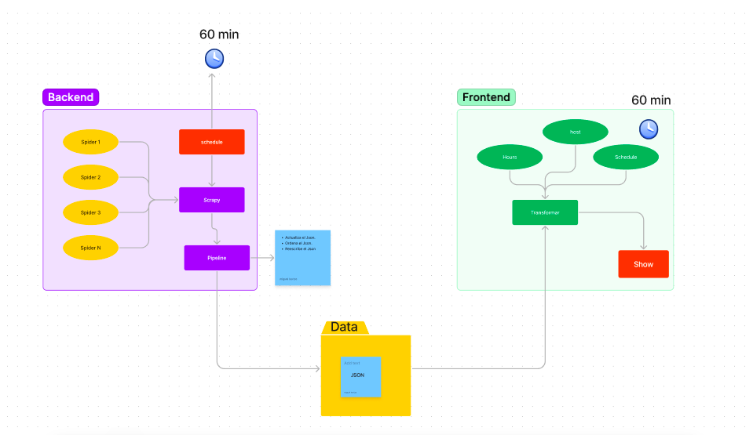
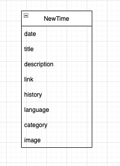

# CryptoNews

Proyecto para visualizar noticas sobre cryptomonedas hecho en Vue.js y Python3.

# Scraping

    NEWS

    https://watcher.guru/news/
    https://cryptonomist.ch/
    https://www.criptovaluta.it/news
    https://www.coindesk.com/
    https://finance.yahoo.com/topic/crypto/
    https://coinmarketcap.com/alexandria/categories/market-musing

    API utili che sarebbe interessante integrare...

    https://alternative.me/crypto/fear-and-greed-index/
    https://coinmarketcap.com/
    https://watcher.guru/whale-tracking

## - Estructura de General

## - Estructura de Datos

### - Tabla

### - Json

    {
        "date": "2022-06-14 18:30:00",
        "title": "Bitcoin Ethereum e Crypto testano nuovi minimi",
        "description": "Marted il crollo del crypto market....",
        "link": "https://it.cryptonews.com/news/bitcoin-ethereum-crypto-test.htm",
        "history": "15/06/2022 03:44:51"
        "language": "ES"
        "category": "CoinBase"
        "image": "imagen_cryptomoneda.png"
    },

## NewTime

    
    1. date: una fecha de la publicacion de la noticia en formato YYY-MM-DD HH-MM-SS. 
        "date": "2022-05-09 08:37:00"

    2. title: Un titulo que te pertenece a cada una de las noticias.
        "title": "Londra:  Ondata di furti crypto"

    3. description: un breve fragmento de que se trata la noticias.
        "description": "Secondo un nuovo rapporto nel Regno Unito i ladri stanno prendendo di mira i trader crypto in un'ondata di furti di criptovalute.",
    
    4. link: La url que sirve para continuar leyendo en el servidor de donde se hizo el Scrapping.
        "link": "https://it.cryptonews.com/news/wave-of-crypto-muggings-hit-londons-financial-district-it.htm",
    
    5. history: una fecha de registro (en el momento que se hizo el scrapping) de la noticia en formato YYY-MM-DD HH-MM-SS. 
        "history": "09/05/2022 16:26:11"

    5. language: EL idioma natural de la noticia.
        "language": "ES"

    5. category: el tipo de cypto que maneja la noticias
        "category": "CoinBase"

    5. image: una url de la imagen que sera usada para identificar la noticia.
        "image": "imagen_cryptomoneda.png"
